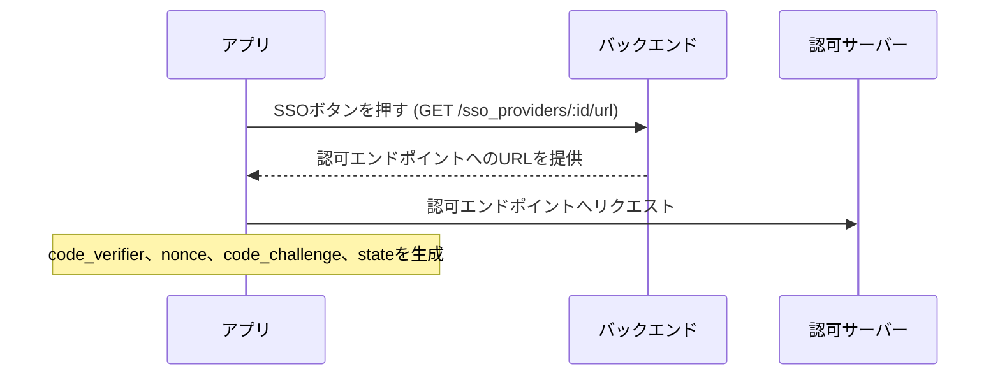
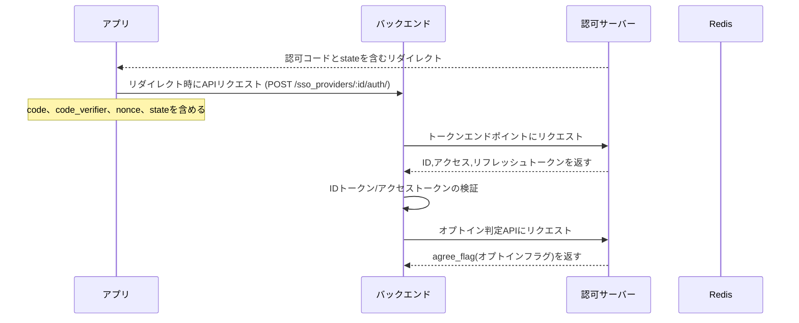
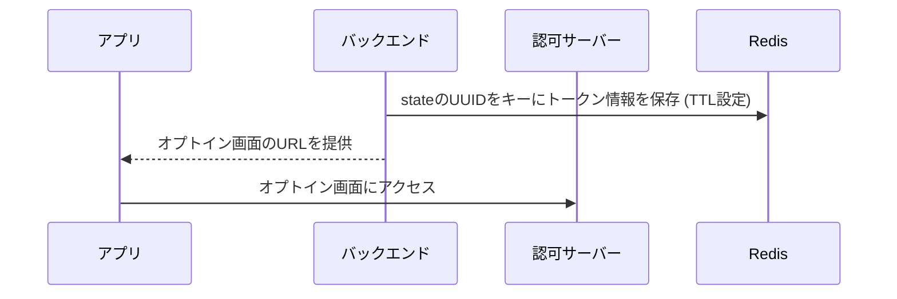
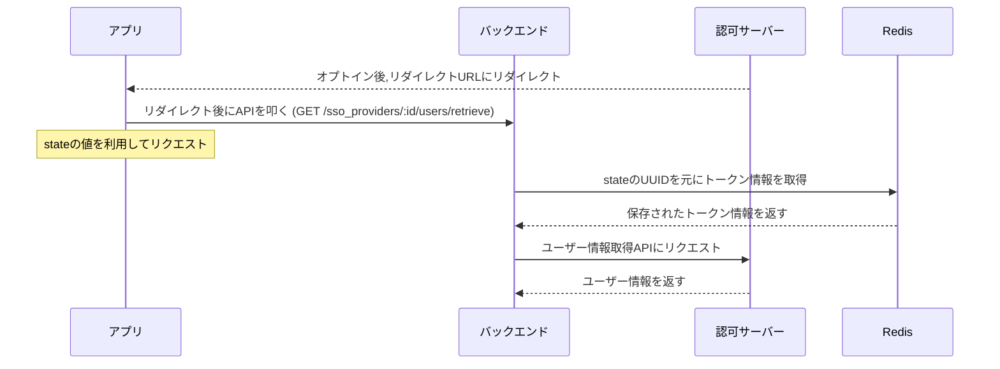

# はじめに

以前,とあるサービスとの連携機能を実装する機会がありました.
このサービスとの連携では,OIDCプロトコルを使用したSSOログインやID連携を行います.
この記事では,特にOIDCの認証フローにおける複数回のリダイレクト処理と,その間の状態管理について考えたことをまとめます.

# 連携の概要

このSSOサービスとの連携では,以下のような機能を実装する必要がありました:

- SSOによるアカウント登録
- SSOによるログイン
- 既存アカウントとSSOアカウントの紐づけ

これらの機能を実装するにあたり,OIDCの認可コードフローを使用しています.

# 課題: 複数回のリダイレクトと状態管理

OIDCの認証フローを実装する中で,特に課題となったのが**オプトイン判定とオプトイン画面からのリダイレクト**です.

通常のOIDCフローでは:

1. 認可エンドポイントへのリダイレクト
2. 認証後,指定したリダイレクトURLへの戻り

という流れになりますが,今回連携したサービスでは:

1. 認可エンドポイントへのリダイレクト
2. 認証後,アプリケーションへのリダイレクト
3. オプトイン判定APIの呼び出し
4. オプトイン未同意の場合,オプトイン画面へのリダイレクト
5. オプトイン同意後,再度アプリケーションへのリダイレクト

という,**2度のリダイレクト**が発生します.

ここで問題となるのが,**1度目のリダイレクトで取得した情報を,2度目のリダイレクト後にどう取得するか**という点です.

# 解決策: stateパラメータとRedisを使った状態管理

この問題を解決するために,以下の方法を採用しました:

1. **stateパラメータにUUIDを含める**
2. **UUIDをキーとしてRedisに情報を保存**

### stateパラメータの設計

OIDCのstateパラメータは,CSRFトークンとしての役割を持ちますが,これを拡張して状態管理にも利用します.

当初は単純なランダム文字列をstateとして使用していましたが,ログインと既存アカウント連携の区別ができないという問題がありました.そこで,`{type}:{uuid}`の形式を採用し,処理の分岐を明確にしました.

```
state = "{type}:{uuid}"
```

- `type`: ログインか連携かを示す識別子 (例: "login", "link")
- `uuid`: ランダムに生成したUUID

例: `login:550e8400-e29b-41d4-a716-446655440000`

### Redisを使った状態保持

stateに含まれるUUIDをキーとして,Redisに以下の情報を保存します:

```
{
  "access_token": "eyJhbGciOiJSUzI1...",
  "id_token": "eyJhbGciOiJSUzI1...",
  "refresh_token": "eyJhbGciOiJSUzI1..."
}
```

TTL(Time To Live)を設定し,一定時間後に自動的に削除されるようにします.

## 実装フロー

### 1. 認可エンドポイントへのリクエスト



この時点で,stateパラメータに`{type}:{uuid}`の形式でUUIDを含めます.

### 2. 認証後の1度目のリダイレクト処理



オプトイン判定の結果,未同意の場合は次のステップに進みます.

### 3. オプトイン未同意時の処理とRedisへの保存



この時点で,stateに含まれるUUIDをキーとして,トークン情報をRedisに保存します.

### 4. オプトイン同意後の2度目のリダイレクト処理



2度目のリダイレクト後,stateに含まれるUUIDを使ってRedisからトークン情報を取得し,ユーザー情報取得APIを呼び出します.

## 実装例

これは設計思想をAIに食わせたら吐いたものです.

### バックエンド側の実装

#### 1. stateパラメータの生成と検証

```ruby
# 認可エンドポイントへのURLを生成する際のstate生成
def generate_state(type)
  uuid = SecureRandom.uuid
  state = "#{type}:#{uuid}"
  state
end

# リダイレクト時のstate検証
def validate_state(state)
  return false if state.blank?
  
  # stateの形式を検証
  parts = state.split(':')
  return false unless parts.length == 2
  
  type = parts[0]
  uuid = parts[1]
  
  # typeが有効か検証
  valid_types = ['login', 'link']
  return false unless valid_types.include?(type)
  
  # UUIDの形式を検証
  uuid_regex = /^[0-9a-f]{8}-[0-9a-f]{4}-[0-9a-f]{4}-[0-9a-f]{4}-[0-9a-f]{12}$/
  return false unless uuid.match?(uuid_regex)
  
  true
end
```

#### 2. Redisへの情報保存

```ruby
# トークン情報をRedisに保存
def store_tokens_in_redis(state, tokens)
  parts = state.split(':')
  uuid = parts[1]
  
  # トークン情報をJSONとして保存
  token_data = {
    access_token: tokens[:access_token],
    id_token: tokens[:id_token],
    refresh_token: tokens[:refresh_token]
  }.to_json
  
  # TTLを5分に設定
  REDIS.setex("sso:tokens:#{uuid}", 5 * 60, token_data)
end

# Redisからトークン情報を取得
def retrieve_tokens_from_redis(state)
  parts = state.split(':')
  uuid = parts[1]
  
  token_data = REDIS.get("sso:tokens:#{uuid}")
  return nil if token_data.nil?
  
  # JSONからハッシュに変換
  JSON.parse(token_data).symbolize_keys
end
```

#### 3. オプトイン判定とリダイレクト処理

```ruby
def handle_auth_callback(code, state, code_verifier, nonce)
  # stateの検証
  unless validate_state(state)
    return { error: 'Invalid state parameter' }
  end
  
  # トークンエンドポイントにリクエスト
  tokens = fetch_tokens(code, code_verifier)
  
  # IDトークンの検証
  unless verify_id_token(tokens[:id_token], nonce)
    return { error: 'Invalid ID token' }
  end
  
  # オプトイン判定APIにリクエスト
  optin_status = check_optin_status(tokens[:access_token])
  
  if optin_status[:agree_flag] == 0
    # オプトイン未同意の場合
    # トークン情報をRedisに保存
    store_tokens_in_redis(state, tokens)
    
    # オプトイン画面のURLを生成
    optin_url = generate_optin_url(state)
    
    return { redirect_to: optin_url }
  else
    # オプトイン同意済みの場合
    # ユーザー情報取得APIにリクエスト
    user_info = fetch_user_info(tokens[:access_token])
    
    # ユーザー情報を元に処理
    process_user_info(user_info, state)
  end
end
```

#### 4. オプトイン後の処理

```ruby
def handle_optin_callback(state)
  # stateの検証
  unless validate_state(state)
    return { error: 'Invalid state parameter' }
  end
  
  # Redisからトークン情報を取得
  tokens = retrieve_tokens_from_redis(state)
  
  if tokens.nil?
    return { error: 'Session expired' }
  end
  
  # ユーザー情報取得APIにリクエスト
  user_info = fetch_user_info(tokens[:access_token])
  
  # ユーザー情報を元に処理
  process_user_info(user_info, state)
end
```

### フロントエンド側の実装

#### 1. 認可エンドポイントへのリクエスト

```javascript
// SSOボタンクリック時の処理
async function handleSSOButtonClick() {
  try {
    // 認可エンドポイントのURLを取得
    const response = await fetch('/sso_providers/1/url?type=login');
    const data = await response.json();
    
    if (data.url) {
      // code_verifierとnonceを生成して保存
      const codeVerifier = generateCodeVerifier();
      const nonce = generateNonce();
      localStorage.setItem('code_verifier', codeVerifier);
      localStorage.setItem('nonce', nonce);
      
      // code_challengeを生成
      const codeChallenge = await generateCodeChallenge(codeVerifier);
      
      // 認可エンドポイントへのURLにパラメータを追加
      const url = new URL(data.url);
      url.searchParams.append('code_challenge', codeChallenge);
      url.searchParams.append('code_challenge_method', 'S256');
      url.searchParams.append('nonce', nonce);
      
      // 認可エンドポイントへリダイレクト
      window.location.href = url.toString();
    }
  } catch (error) {
    console.error('Error fetching authorization URL:', error);
  }
}

// code_verifierの生成
function generateCodeVerifier() {
  const array = new Uint8Array(32);
  window.crypto.getRandomValues(array);
  return base64UrlEncode(array);
}

// nonceの生成
function generateNonce() {
  const array = new Uint8Array(16);
  window.crypto.getRandomValues(array);
  return base64UrlEncode(array);
}

// code_challengeの生成
async function generateCodeChallenge(codeVerifier) {
  const encoder = new TextEncoder();
  const data = encoder.encode(codeVerifier);
  const digest = await window.crypto.subtle.digest('SHA-256', data);
  return base64UrlEncode(new Uint8Array(digest));
}

// Base64 URL エンコード
function base64UrlEncode(array) {
  return btoa(String.fromCharCode.apply(null, array))
    .replace(/\+/g, '-')
    .replace(/\//g, '_')
    .replace(/=+$/, '');
}
```

#### 2. リダイレクト後の処理

```javascript
// 認可エンドポイントからのリダイレクト処理
async function handleAuthCallback() {
  // URLからパラメータを取得
  const urlParams = new URLSearchParams(window.location.search);
  const code = urlParams.get('code');
  const state = urlParams.get('state');
  
  if (!code || !state) {
    console.error('Missing code or state parameter');
    return;
  }
  
  // ローカルストレージからcode_verifierとnonceを取得
  const codeVerifier = localStorage.getItem('code_verifier');
  const nonce = localStorage.getItem('nonce');
  
  try {
    // バックエンドAPIにリクエスト
    const response = await fetch('/sso_providers/1/auth', {
      method: 'POST',
      headers: {
        'Content-Type': 'application/json',
        'X-App-Type': 'web'
      },
      body: JSON.stringify({
        code,
        state,
        code_verifier: codeVerifier,
        nonce
      })
    });
    
    const data = await response.json();
    
    if (data.redirect_to) {
      // オプトイン画面へのリダイレクトが必要な場合
      window.location.href = data.redirect_to;
    } else if (data.authentication_token) {
      // 認証成功の場合
      localStorage.setItem('auth_token', data.authentication_token);
      navigateToHome();
    } else if (data.error) {
      // エラーの場合
      showError(data.error);
    }
  } catch (error) {
    console.error('Error during authentication:', error);
  } finally {
    // 使用済みのcode_verifierとnonceを削除
    localStorage.removeItem('code_verifier');
    localStorage.removeItem('nonce');
  }
}

// オプトイン画面からのリダイレクト処理
async function handleOptinCallback() {
  // URLからstateパラメータを取得
  const urlParams = new URLSearchParams(window.location.search);
  const state = urlParams.get('state');
  
  if (!state) {
    console.error('Missing state parameter');
    return;
  }
  
  try {
    // バックエンドAPIにリクエスト
    const response = await fetch(`/sso_providers/1/users/retrieve?state=${state}`);
    const data = await response.json();
    
    if (data.authentication_token) {
      // 認証成功の場合
      localStorage.setItem('auth_token', data.authentication_token);
      navigateToHome();
    } else if (data.sso_id) {
      // ユーザー登録が必要な場合
      navigateToRegistration(data.sso_id, data.provider_id);
    } else if (data.error) {
      // エラーの場合
      showError(data.error);
    }
  } catch (error) {
    console.error('Error retrieving user info:', error);
  }
}
```

## 実装上の工夫

### 1. エラー処理の強化

実際の実装では,以下のようなエラーケースを考慮しました:

- Redisへの保存/取得に失敗した場合
- トークンの有効期限が切れた場合
- オプトイン画面でユーザーが同意をキャンセルした場合

これらのケースに対応するため,エラーメッセージを適切に表示し,必要に応じて認証フローを最初からやり直すようにしています.

### 2. セキュリティ強化

セキュリティを強化するために,以下の対策を実装しました:

- stateパラメータの厳格な検証
- IDトークンの署名検証と有効期限チェック
- Redisに保存するデータの暗号化
- CSRFトークンの使用

# 今後の改善点

**リフレッシュトークンの活用**: 現在はアクセストークンの有効期限が切れた場合,認証フローをやり直していますが, 完全にリフレッシュトークンの存在を忘れていました